## Membres du groupe:
## Made by : Team Claude 3000 !
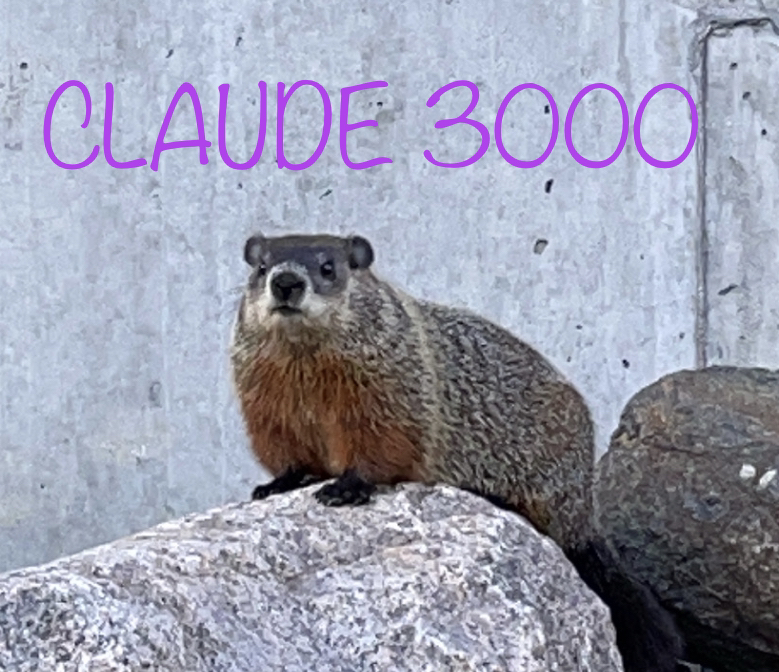
 
- Aurélien CHEVALLEREAU CHEA22100006 
- Nicolas DEBEAULIEU DEBN28109909 
- Antoine TABARAUD TABA29049900 
- Michael LAMBERT LAMM13019806 

 
Eté 2022, UQAC, CA
 
 

___

# Code source devoir 1:
## Nouvelles fonctionnalités:
- ajout de Claudius le Drunkman
- une classe DialogApp qui s'occupe des threads (3 pour les entités et 1 pour la synchronisation)
- une classe MessagesManagerClass instanciée sous le nom MessagesManager qui s'occupe de manager les messages et de les afficher (via le thread de synchronisation)

## Exécutable :
Buckland_Chapter2-State Machines\WestWorldWithMessaging\Debug\WestWorldWithMessaging.exe

[Télécharger ici](../../releases/download/Devoir%2F1/WestWorldWithMessaging.zip)

## Illustrations :

| Diagramme d'état transition Miner | Diagramme d'état transition DrunkMan |
| :---: | :---: |
| 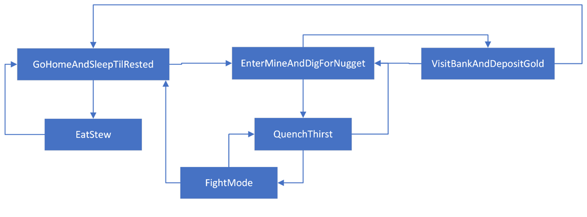 | 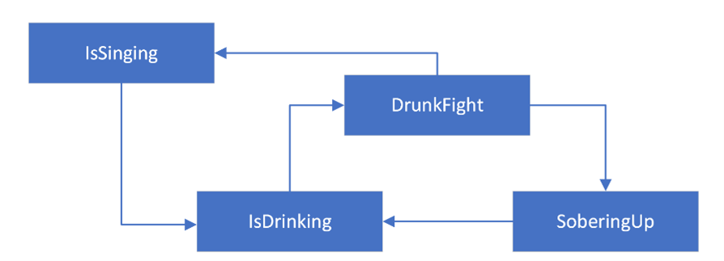 |

|  | Dialogue |  |
| :---: | :---: | :---: |
| 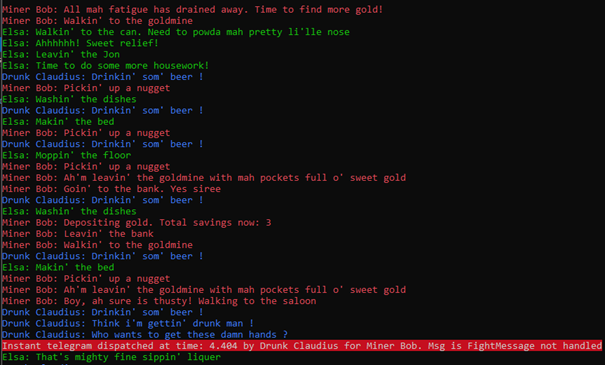 | 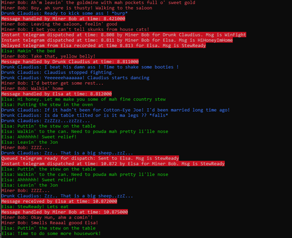 | 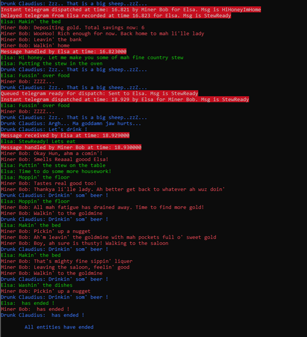 |

# Code source devoir 2:
## Nouvelles fonctionnalités:
- Ajout d'un agent leader et 20 agents poursuiveurs
- Ajout de plusieurs type de formations: *(interchangeable via le menu "Poursuiveurs" de l'interface)*
  - wandering (par défaut)
  - en Ligne
  - en Cercle
  - en V
  - en Cercles multiples
- Possibilité de controler le leader avec les touches ZQSD ou WASD (wandering par défaut) *(interchangeable via le menu "Leader" de l'interface)*
- Changement de la couleur du leader : rouge
- Changement de la couleur des agents poursuiveurs : bleu
- Ajout d'aides supplémentaires dans l'affichage des contrôles pour la vitesse du leader et de direction
- Changement de la méthode de calcul par défaut : weighted sum
- Changement du titre de la fenêtre d'exécution
- *(undefine SHOAL dans le code)*

## Exécutable :
:warning: **Attention** : s'il n'y est pas déjà, copier/coller le fichier **[params.ini](Buckland_Chapter3-Steering%20Behaviors/params.ini)** dans le dossier [Debug](Buckland_Chapter3-Steering%20Behaviors/Debug) ou [Release](Buckland_Chapter3-Steering%20Behaviors/Release) généré par VS Studio.

Buckland_Chapter3-State Machines\Debug\Steering.exe

[Télécharger ici](../../releases/download/Devoir%2F2/Steering.Behavior.zip)

## Illustrations :

| Formation en V | Formation en Ligne |
| :---: | :---: |
| 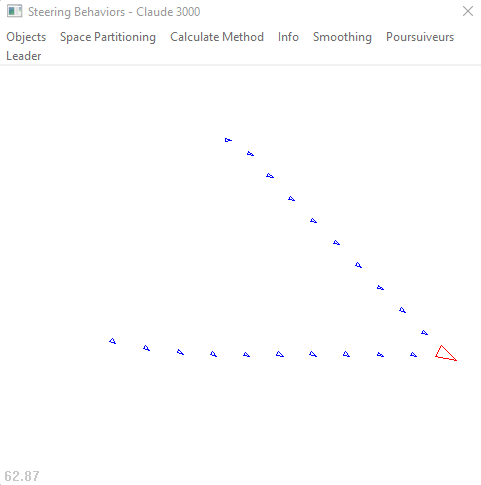 | 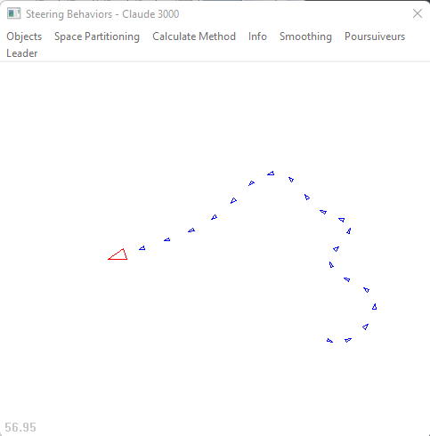 |

| Formation en Cercle | Formation en Cercles Multiplas |
| :---: | :---: |
| 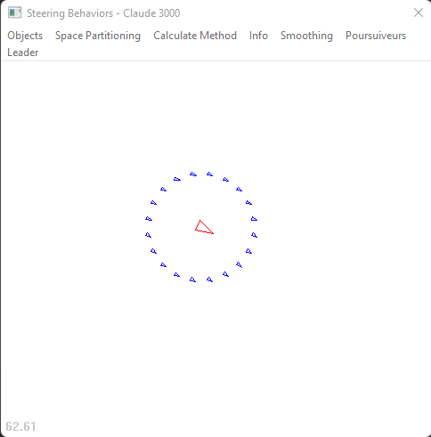 | 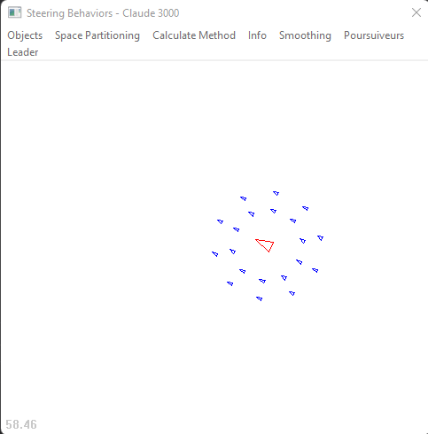 |

| Affichage infos |
| :---: |
| 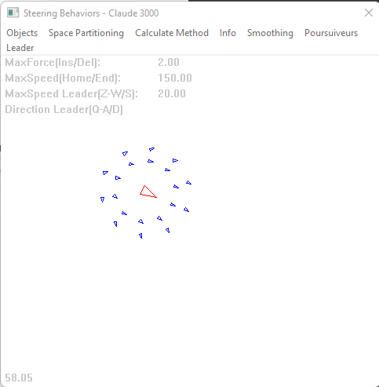 |

# Projet Raven:

## Nouvelles fonctionnalités (résumé):
- Interface de sélection des modes (+ options bots apprenants)
- Fuzzy module
- Contrôle par un humain via la souris et les touches WASD
- Mode Team avec leader et système de point de loot (dépôts des armes quand on meurt)
- Apprentissage soit de l'humain, soit des meilleurs bots puis création de bots apprenants
- Ajout d'un but de fuite et en mode TeamMatch, de récupération de loot
- Comportement de protection du leader s'il est touché

## Exécutable :

:warning: **Attention** : s'il n'y est pas déjà, copier/coller le fichier **[params.ini](Buckland_Chapter7%20to%2010_Raven/Params.ini)** dans le dossier [Debug](Buckland_Chapter7%20to%2010_Raven/Debug) ou [Release](Buckland_Chapter7%20to%2010_Raven/Release) généré par VS Studio.
Il faut également avoir les dossiers **[Map Editor](Buckland_Chapter7%20to%2010_Raven/Map%20Editor/)** et **[maps](Buckland_Chapter7%20to%2010_Raven/maps/)**.

Buckland_Chapter7 to 10_Raven\Debug\Raven.exe

[Télécharger ici](../../releases/download/ProjetRaven/Raven.zip)

## Nouvelles fonctionnalités :

| Interface |
| :---: |
| 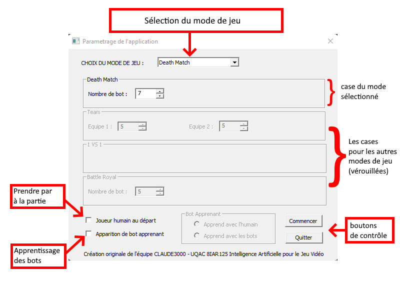 |

- L'interface du jeu est une boîte de dialogue avec un bouton Commencer et un bouton Quitter
- Le menu déroulant de la partie supérieure indique le mode jeu sélectionné
- À chaque mode correspond une case située en dessous. Sélectionner un mode déverrouille sa case et verrouille les autres
- Les types de parties ont chacune besoin de leurs propres paramètres que vous pouvez alors choisir
- Vous avez aussi la possibilité de vous joindre à la partie avec la checkbox "Joueur humain au départ"
- De même, il est possible de sélectionner "Apparition de bots apprenant" ajoutant de l'apprentissage aux bots de la partie
  - Cet apprentissage se fait via les performances d'autres bots ou bien les vôtres
- Il est possible de revenir au menu via le bouton ESC lorsque vous êtes en jeu ou bien par le menu d'item "Game" -> "Main Menu"

| Modes de jeu | |
| :---: | :---: |
| 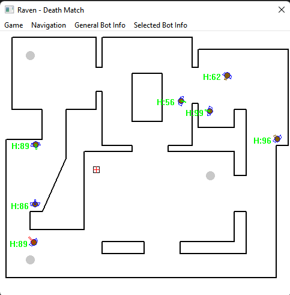 | 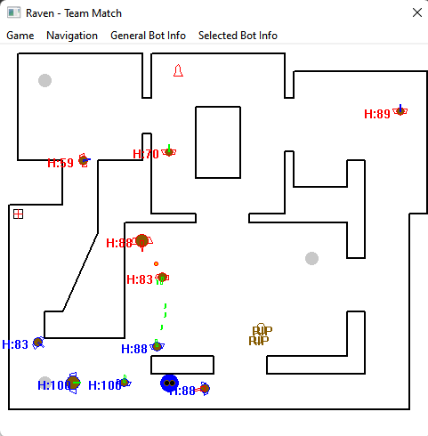 |
| 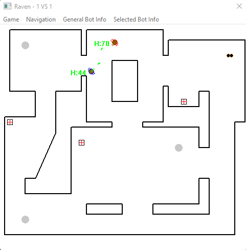 | 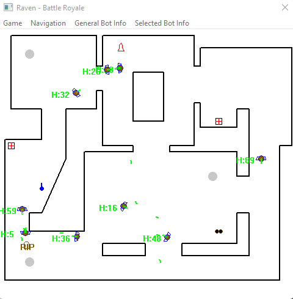 |

| Teams   & Création des loots | Goal Get Loot |
| :---: | :---: |
| 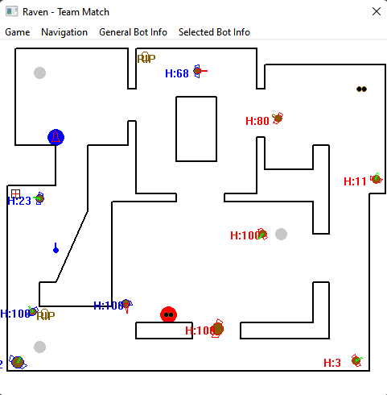 | 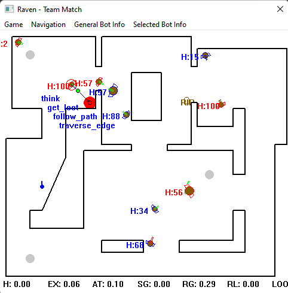 |
| 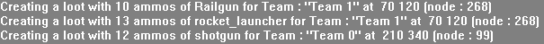 | |

- Le mode TeamMatch est un mode de jeu qui permet de créer 2 équipes avec un nombre de bots défini via l'interface. Chaque équipe a un nom et une couleur différente.
- Chaque équipe a un leader, s'il subit des dégâts, il envoi une message a toute son équipe pour se mettre en formation autour de lui (sauf s'il croise un ennemi sur le trajet)
- Une fois qu'un membre de l'équipe est mort, il dépose ses armes pour lesquelles il lui reste des munitions. Ce dépôt est sur un node connu de l'équipe et défini aléatoirement à la création des équipes. Cette zone de dépôt reprend la couleur de l'équipe et le rendu de l'arme associée.
- Si un joueur n'a plus assez de munitions, il a pour nouveau but d'aller chercher le loot de son équipe s'il y en a.
- Les membres d'une équipe ne peuvent pas récurer le loot d'une équipe adverse.

| Apprentissage avec réseau de neurones | Bots apprenants (en jaune) |
| :---: | :---: |
| 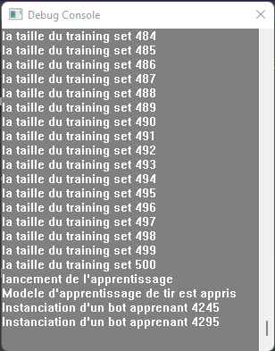 | 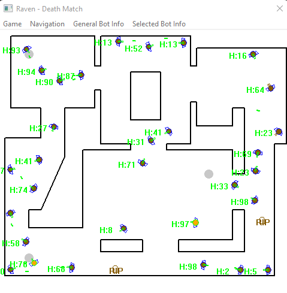 |

Il est possible, en choisissant la fonctionnalité correspondante dans le menu principal, de permettre la création de bots apprenants.
Les bots peuvent soit apprendre du bot contrôlé par l'humain après qu'il ait tué 1 ennemi, soit du premier bot ayant tué 2 ennemis. Une fois ces conditions
remplies, un jeu de 500 données se basant sur la distance à l'ennemi, ses munitions et armes restantes, sa vie, etc est créé à partir du bot concerné pour
entraîner un réseau de neurones.
Une fois le réseau entraîné et si on se trouve dans un mode ou le respawn des bots est possible, alors à chaque respawn, il y aura une
chance sur 2 pour que le bot créé soit un bot apprenant.

| Ajout du but de fuite |
| :---: |
| 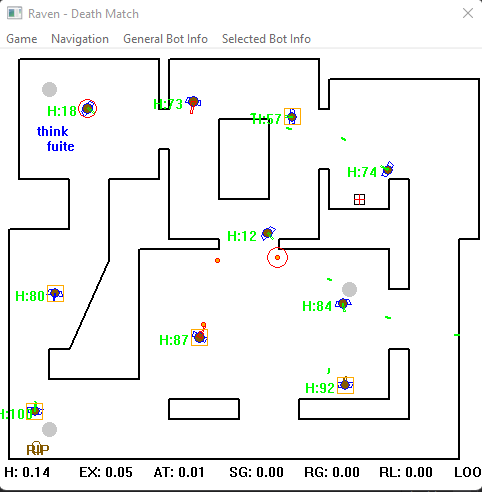 |

Il a également été ajouté un but de fuite aux bots : lorsque ceux-ci ont un nombre de points de vie inférieur à 20, ils passent alors en mode fuite.
Dans cet état, les bots cherchent à éviter leurs adversaires et sont repoussés par ces derniers lorsqu'ils s'approchent. Dès qu'un objet de soin apparaît,
alors le bot dans l'état de fuite cherchera à le récupérer rapidement. Une fois ceci fait, il retrouve un comportement normal.

| Contrôle du joueur |
| :---: |
- Par défaut, un bot possédé peut être déplacé à travers la carte avec le click droit de la souris.
- On a alors implémenté que les touches WASD peuvent être utilisées afin de contrôler le bot.
- Avancer et reculer fonctionnent en fonction d'où le joueur regarde (qui est contrôlé par le curseur de la souris)
- La gauche et la droite fonctionnent en fonction de la position du curseur de la souris, où le bot se déplace en arc à partir du curseur, afin de faciliter
  l'évitement des projectiles tout en pouvant tirer sur les ennemis.

| Formation de protection du leader |
| :---: |
| 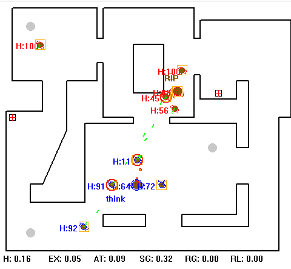 |

- Une implémentation de protection du leader a été introduite dans le projet.
- Lorsque le leader d'une équipe se fait attaquer, les autres membres de l'équipe créent une formation en cercle autour du leader.
- Lorsque le leader meurt où qu'ils ne peuvent pas protéger le leader selon les limites de la carte, les bots retournent à la normale.